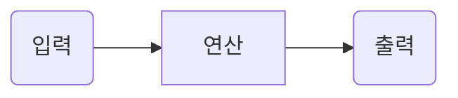

## clone

aframe : <https://github.com/aframevr/aframe.git>  
webxr : <https://github.com/Apress/ar-vr-using-webxr-api.git>

## AR-VR-Using-WebXR
6. Basic WebXR (생명주기), Three.js - WebXR API 연동 VR  
 <https://contravia-cloud.github.io/AR_project/AR-VR-Using-WebXR/ch6.html>
7. Three.js - WebXR API 연동 AR   
<https://contravia-cloud.github.io/AR_project/AR-VR-Using-WebXR/ch7-1.html>
8. aframe VR 블럭표시  
 <https://contravia-cloud.github.io/AR_project/AR-VR-Using-WebXR/ch8-1.html>


```javascript
// create context
gl = new THREE.WebGLRenderer({antialias: true});
gl.setPixelRatio(window.devicePixelRatio);
gl.setSize(window.innerWidth, window.innerHeight);
gl.outputEncoding = THREE.sRGBEncoding;
gl.xr.enabled = true;
document.body.appendChild(gl.domElement);
document.body.appendChild(VRButton.createButton(gl));

```
수평선

---




